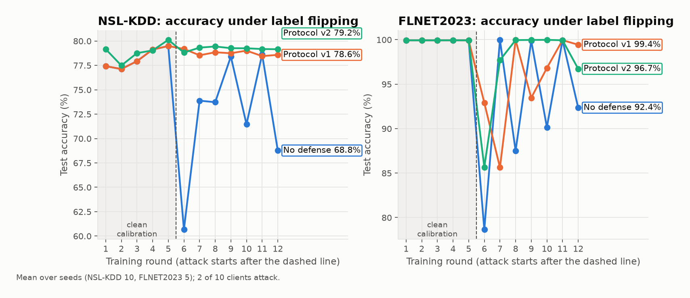
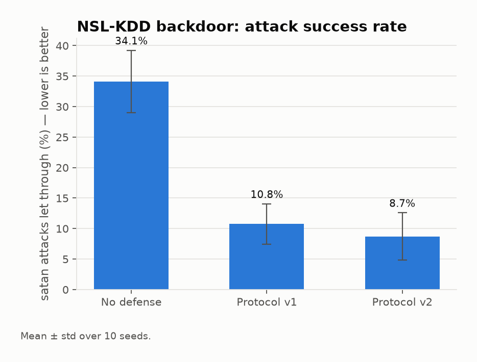
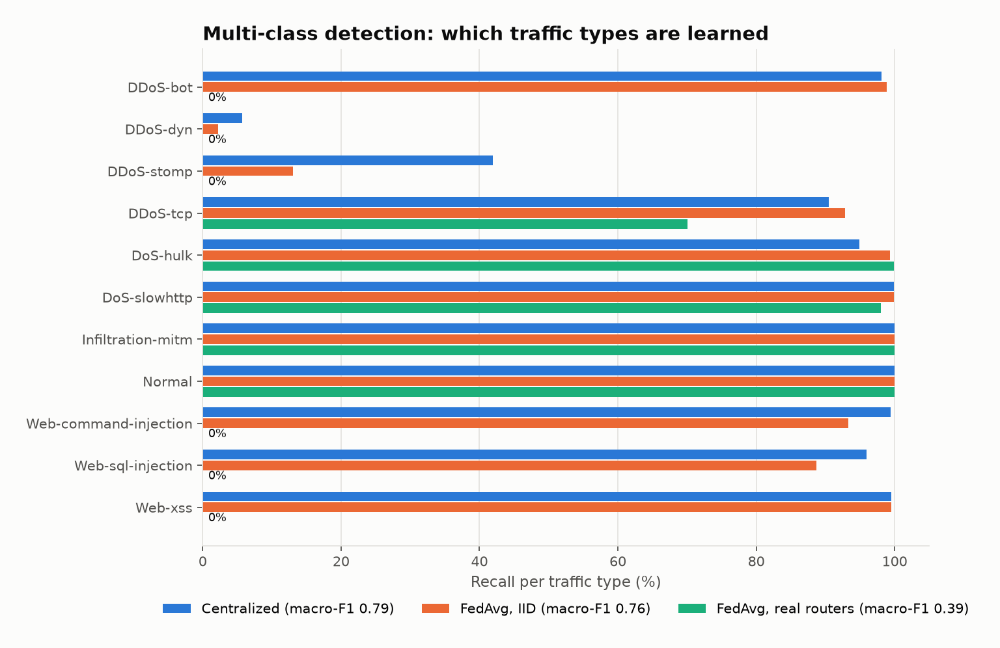
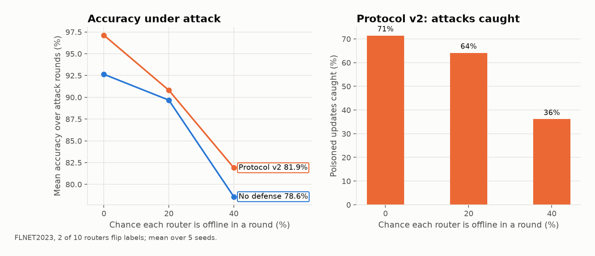
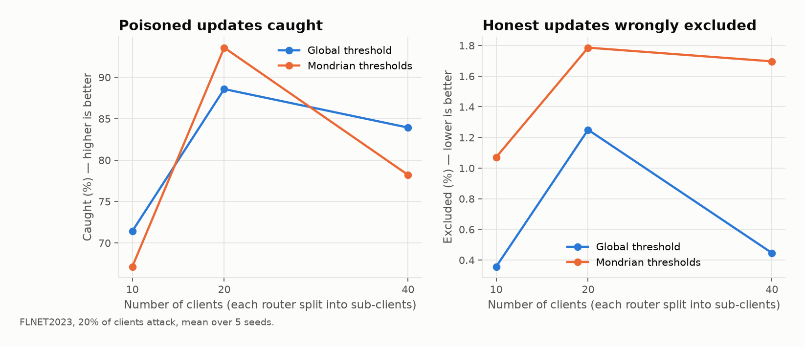
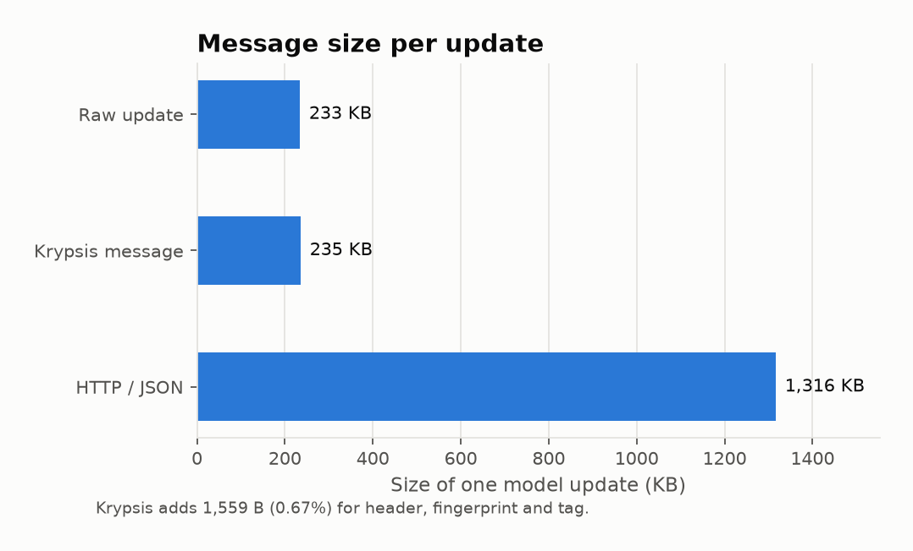

# Krypsis — Federated Learning-based Network Intrusion Detection with a Custom Communication Protocol

A federated learning based network intrusion detection system using a custom
communication protocol.

## Team Members

| S. No. | Name | Roll No. / Reg. No. |
|---|---|---|
| 1 | RITHIKA K | CB.SC.U4AIE25126 |
| 2 | PRADHANIYA S | CB.SC.U4AIE25148 |
| 3 | SATHYA K | CB.SC.U4AIE25154 |
| 4 | VINUDHARSHINI PP | CB.SC.U4AIE25161 |

## Abstract

Network Intrusion Detection Systems (NIDS) are a critical line of defence against
cyberattacks, but conventional approaches typically rely on centralized data
collection, requiring organizations to pool sensitive network traffic on a single
server for model training. This centralization introduces serious privacy risks,
regulatory concerns, and a single point of failure, while also creating
communication bottlenecks when large volumes of traffic data must be transmitted.

This project proposes a Federated Learning-based Network Intrusion Detection
System that trains a shared detection model collaboratively across multiple
distributed clients (e.g., routers, edge devices, or organizational nodes)
without ever transmitting raw traffic data to a central server. Instead, each
client trains a local model on its own data and shares only model updates
(weights/gradients) with a central aggregator, which combines them into a
global model using a federated averaging strategy (FedAvg).

To support this distributed training process efficiently and securely, the
project designs and implements a custom **security-fused communication
protocol** for exchanging model updates between clients and the server. Unlike
generic protocols (HTTP/gRPC) or prior communication-efficiency work — which
treats bandwidth optimization and security as separate concerns, with
malicious-update detection only happening after the full update has been
received and processed by the server — this protocol attaches a lightweight
integrity tag and a compact statistical "fingerprint" to every update at send
time. The server performs a cheap first-pass anomaly check against this
fingerprint before committing to expensive aggregation, allowing tampered,
corrupted, or blatantly poisoned updates to be rejected early and cheaply,
rather than only being caught (or missed) by post-hoc robust aggregation
methods (e.g., Krum, trimmed mean). The resulting system is evaluated on
the FLNET2023 intrusion detection dataset, whose traffic was captured at 10
separate routers that serve directly as the federated clients, measuring detection accuracy, communication
overhead, poisoning-attack detection/false-positive rates, and convergence
speed compared to centralized and standard federated baselines.

## Objectives

1. Design a Federated Learning framework capable of training an intrusion
   detection model across multiple distributed clients without centralizing
   raw network traffic data.
2. Design and implement a custom, security-fused communication protocol that
   combines lightweight message integrity verification and a cheap
   transport-layer anomaly "fingerprint" check with efficient exchange of
   model updates — filtering tampered or malicious updates before they reach
   the server's aggregation stage, rather than relying solely on post-hoc
   server-side robust aggregation.
3. Evaluate the system's intrusion detection performance (accuracy, precision,
   recall, F1-score) on benchmark datasets under a federated setting.
4. Analyse communication overhead, convergence behaviour, and scalability of
   the custom protocol against standard federated learning communication
   methods (e.g., gRPC/HTTP as baseline), including the added cost of the
   integrity/fingerprint layer itself.
5. Assess the system's robustness against client dropouts, non-IID data
   distribution across clients, and adversarial/malicious client updates —
   specifically, testing whether a single global anomaly threshold
   systematically misclassifies honest non-IID clients as malicious, and
   evaluating Mondrian-style per-cluster threshold calibration as a
   mitigation, measured via detection rate and false-positive rate on
   injected label-flipping and backdoor poisoning attacks across repeated
   trials.

## Motivation

With the rapid growth of interconnected devices and network infrastructure,
cyberattacks have become more frequent, sophisticated, and distributed in
nature. Traditional centralized NIDS require aggregating traffic logs from
multiple network segments or organizations into one location for model
training — but this is often impractical or unsafe: network traffic can reveal
sensitive information about users, internal infrastructure, and business
operations, and many organizations are unwilling or legally unable (e.g., under
data protection regulations) to share this data externally.

Federated Learning addresses this privacy gap by keeping data local and only
sharing model parameters, making collaborative intrusion detection feasible
across organizational or geographic boundaries. However, standard federated
learning implementations often use generic, heavyweight communication
protocols not optimized for the specific needs of this setting — frequent
small updates, unreliable network links at the edge, and the need for
verifying update integrity to prevent poisoning attacks. This motivates the
design of a custom, purpose-built communication protocol that makes federated
NIDS both more practical for real-world, bandwidth-constrained deployments and
more secure against communication-level threats, ultimately contributing
toward a scalable, privacy-preserving approach to network security.

## Novelty / Research Gap

Federated Learning for NIDS is a well-established research area (see
`References` below for a comprehensive 2024 survey). Within it, two
sub-problems are usually solved **separately**:

- **Communication efficiency** — reducing the bandwidth cost of sending model
  updates, typically via compression, quantization, or smarter client
  selection (e.g., eFedAD, adaptive client selection). These approaches do
  not address security.
- **Robustness to malicious/poisoned updates** — typically handled entirely
  at the server, *after* an update has already been fully received and
  processed, via robust aggregation strategies (FedAvg variants, Krum,
  trimmed mean, median-based aggregation).

**This project fuses the two at the protocol level.** Rather than treating
bandwidth and security as independent concerns solved at different stages,
the custom protocol attaches a compact integrity tag and statistical
fingerprint to each update at the point of transmission, enabling a cheap,
early anomaly check *before* the expensive server-side aggregation pipeline
runs — reducing wasted bandwidth/compute on updates that are corrupted or
maliciously poisoned, while still allowing existing robust-aggregation
methods to run as a second line of defense on updates that pass. To the best
of our review, this specific combination — transport-layer integrity +
anomaly filtering, co-designed with (rather than bolted onto) an
efficiency-oriented FL communication protocol for NIDS — is not directly
addressed in existing literature, which is the gap this project targets.

### Research Question

Anomaly-based filtering (this project's fingerprint check, and existing
methods like Krum) all rely on the same signal: *how different is this
update from the consensus?* That signal has a known weakness — under
**non-IID** clients (Objective 5), an honest client's update can look
"different from consensus" for entirely legitimate reasons (its local
traffic genuinely differs), not because it is malicious. A single **global**
anomaly threshold cannot distinguish "different because malicious" from
"different because honestly non-IID." This is structurally the same failure
mode as *marginal vs. subgroup-conditional coverage* in conformal
prediction — a global calibration that looks fine on average can fail badly
for specific subgroups.

This project investigates that question directly, and evaluates the
analogous fix: **Mondrian-style stratified calibration.** Instead of one
global threshold, clients are grouped into clusters based on their local
data-distribution profile (computed from calibration-round data only, to
avoid leakage — the update statistics of the *current* round under test are
never used to define the clusters), and a separate anomaly threshold is
calibrated per cluster. The research question is:

> **Does a single global fingerprint threshold systematically misclassify
> honest non-IID clients as malicious, and does Mondrian-style per-cluster
> threshold calibration reduce that false-positive rate without weakening
> real poisoning-attack detection?**

This project does not claim to invent Mondrian calibration, conformal
prediction, or FedAvg — all are established techniques. The contribution is
testing whether a documented subgroup-conditional failure mode of
consensus-based anomaly detection reappears in transport-layer FL security
filtering under non-IID clients, and empirically evaluating a
stratified-calibration mitigation for it.

## Custom Protocol Design (Concrete Specification)

Every round, each client sends its update `δθ = θ_local − θ_global` (the
difference between its locally trained weights and the global weights it
started the round with). The protocol wraps this payload as follows:

**1. Integrity tag** — an HMAC (or SHA-256 hash) computed over the serialized
`δθ`, sent alongside the payload. The server recomputes it on receipt; a
mismatch means the update was corrupted or tampered with in transit, and it
is rejected immediately, before any further processing.

**2. Fingerprint vector** — a small set of cheap summary statistics computed
over `δθ`, sent as a compact header (a handful of floats, negligible size
next to the full model):

| Statistic | What it captures |
|---|---|
| `‖δθ‖₂` (global L2 norm) | Overall magnitude of the update |
| `‖δθ_layer‖₂` per layer (3 values, one per MLP layer) | Whether the perturbation is concentrated in one layer (e.g., the output layer — common in label-flipping attacks) |
| `cos_sim(δθ, δθ_prev)` | Similarity to this same client's update last round — flags a client suddenly behaving very differently |
| `cos_sim(δθ, δθ_mean_this_round)` | Similarity to the average direction of all clients this round — flags an update pointing away from consensus (same intuition as Krum, computed as one cheap number instead of full pairwise distances) |

**3. Server-side decision rule (cheap, before aggregation):**
1. Verify the integrity tag. Mismatch → reject outright.
2. Compute a z-score of the global L2 norm against a rolling mean/std of that
   client's own recent accepted norms. Large deviation → flag.
3. Compare the two cosine similarities against thresholds. Low similarity →
   flag.
4. **Unflagged updates** go straight into standard FedAvg. **Flagged
   updates** are routed to the heavier existing defenses (Krum / trimmed
   mean) for a second, more expensive check — rather than running those
   expensive checks on every client, every round.

**4. Two threshold-calibration variants, compared head-to-head (this is the
Research Question above, made operational):**
- **Global variant (baseline):** one threshold, fit across all clients
  together.
- **Mondrian variant:** clients are assigned to a cluster (e.g., via k-means
  on each client's local class-distribution / feature-summary profile,
  computed once from calibration-round data), and each cluster gets its own
  threshold, fit only from that cluster's calibration-round statistics.

Both variants are run against the same attack simulations so their
false-positive rate (on honest, non-IID clients) and detection rate (on
injected malicious clients) can be compared directly.

This is what makes the "cheap filter before expensive aggregation" claim in
the Novelty section concrete and implementable, rather than a placeholder
phrase. Threshold values, cluster count, and whether flagged updates are
hard-rejected vs. down-weighted are tuning decisions to be made empirically
once attack simulations (Phase: poisoning evaluation) are running.

### As implemented (`src/protocol.py`)

The implementation follows the spec above, with these changes — each made
for a concrete reason found while building it:

- **Wire format:** `[4-byte header length][JSON header][float32 payload]
  [32-byte HMAC-SHA256 tag]`. The tag covers header *and* payload, with a
  per-client pre-shared key.
- **Fingerprint = L2 norm + per-layer L2 norms (4 Dense layers) + a
  64-number random-projection "sketch" of `δθ`.** The spec's
  `cos_sim(δθ, δθ_mean_this_round)` cannot be computed by a client (it
  does not know the other clients' updates); instead the server compares
  sketches, which preserve cosine similarity approximately. The projection
  matrix comes from a public seed, so client and server compute the same
  sketch.
- **The server re-computes the fingerprint from the payload** and rejects
  the message on mismatch — otherwise a malicious client could simply send
  an innocent-looking fingerprint.
- **Three scores:** norm (`|log(‖δθ‖ / round median)|`), consensus
  (`1 − cos(sketch, coordinate-wise median sketch)`), and history
  (`1 − cos(sketch, own previous sketch)`). Medians rather than means, so
  the attackers cannot pull the consensus toward themselves.
- **Scores are robust-z-standardized within each round** (median / MAD
  across that round's clients). Without this the protocol was unusable:
  FLNET2023 is learned within ~5 rounds, after which *every* honest update
  is small and noisy, all raw scores drift upward, and thresholds fit on
  the calibration rounds flagged **65–96% of honest updates**. Measured,
  fixed, and kept here as a documented negative result.
- **Thresholds are conformal quantiles** (`ceil((n+1)(1−α))`-th smallest
  calibration score, α = 0.05 per score) fit on 5 clean calibration
  rounds. Mondrian clusters: k-means (k = 3) on each client's mean
  calibration-round sketch — no labels or raw data needed. A cluster with
  too few calibration scores for a valid quantile falls back to the
  global threshold.
- **Flagged updates are dropped** in the Phase 8 version. Phase 9 adds the
  second check (trimmed-mean reference) and a per-client weight cap — see
  Progress Log > Phase 9.

## Scope

This project is ambitious (FL + custom protocol + integrity + fingerprinting
+ poisoning attacks + robust aggregation + non-IID + multiple datasets). To
keep it achievable within a UG timeline, work is split into a **core** that
must fully work end-to-end, and **stretch goals** added only once the core is
solid.

**Core (must have, in build order):**
1. FLNET2023 download + preprocessing
2. Federated clients — the **real per-router split** (FLNET2023's 10
   routers = 10 clients; naturally non-IID, and the research question
   depends on it), plus an **IID control split** of the same data
3. MLP model
4. FedAvg training loop, evaluated against a centralized baseline
5. Custom protocol: integrity tag + fingerprint, wired into the training loop
6. One poisoning attack simulated (label-flipping — simplest to implement)
7. **Global vs. Mondrian-style per-cluster threshold comparison** — the
   central experiment answering the Research Question
8. Repeated trials (≥15–20 random seeds) with mean ± std reported, plus a
   basic significance test (e.g., paired t-test) comparing global vs.
   Mondrian false-positive rates
9. Comparison: standard HTTP/gRPC-style transfer vs. custom protocol, on
   communication overhead, detection rate, false-positive rate
10. Accuracy / precision / recall / F1 reporting

**Stretch goals (add only after the core works and is evaluated):**
- Krum / trimmed mean as a fallback layer for flagged updates
- Client dropout simulation
- Backdoor attack (in addition to label-flipping)
- Distribution-shift stress test: a client's traffic profile drifts mid-
  training (e.g., a previously unseen attack type appears), comparing how
  global vs. Mondrian thresholds degrade
- **Multi-class attack-type classification** — the binary task is close
  to saturated on FLNET2023 (see Progress Log > Phase 5), so a per-attack-type
  model is the natural next step and makes client heterogeneity matter more
- **NSL-KDD / CICIDS2017 as a replication study** — testing whether the
  global-vs-Mondrian effect holds on a dataset where client heterogeneity has
  to be simulated
- Scalability experiments (more simulated clients)

The single most important thing for the final grade is a **working,
measured core** — a partially-implemented long feature list is worse than a
complete short one.

## Evaluation Plan

Evaluation is deliberately multi-axis, not just accuracy:

- **Detection performance:** accuracy, precision, recall, F1-score of the
  underlying NIDS model.
- **Attack detection rate:** % of injected poisoned updates caught, global
  vs. Mondrian threshold.
- **False-positive rate on honest clients:** % of legitimate non-IID clients
  wrongly flagged, global vs. Mondrian threshold — this is the headline
  comparison for the Research Question.
- **Communication overhead:** bytes transferred, custom protocol vs.
  standard HTTP/gRPC-style baseline.
- **Latency/compute cost:** overhead added by computing and checking the
  fingerprint itself.
- **Convergence behaviour:** accuracy vs. training round, with and without
  active poisoning.
- **Statistical robustness:** all of the above repeated across ≥15–20
  random seeds (client partitioning + attack injection), reported as mean ±
  std, with a significance test on the headline comparison.
- **Distribution shift (stretch):** how detection/false-positive rates
  change when a client's traffic profile drifts mid-training.

**Methodological note:** client heterogeneity comes from FLNET2023's own
per-router captures, not from an artificial partition. The network itself is
*emulated* (CORE emulator, scripted normal traffic and attack tools), not a
production network, and that shows up as unusually easy class separation
(see Progress Log > Phase 5). This is stated explicitly rather than implied.

## Model

- **Architecture:** Multi-Layer Perceptron (MLP) — feedforward neural network
  (66 input features → Dense 256 → Dense 128 → Dense 64 (ReLU, with Dropout
  and L2) → output layer, 1 neuron, sigmoid).
- **Task:** Binary classification (`normal` vs `attack`) as the first
  milestone; multi-class attack-type classification as a later extension.
- **Why an MLP:** the dataset is tabular (rows of numeric flow features), not image or sequence data, so a simple feedforward
  network is the standard, well-supported choice for this task and averages
  cleanly under FedAvg.

## Dataset

- **FLNET2023** — *Realistic Network Intrusion Detection Dataset for Federated
  Learning* (Kumar, Liu, et al., MILCOM 2023). Network flows recorded at 10
  routers (D1–D10) of a 40-node network emulated with CORE, with features
  extracted by CICFlowMeter (83 columns per flow).
- Traffic types: Normal; DDoS (bot, dyn, stomp, tcp); DoS (hulk, slowhttp);
  Web (SQL injection, command injection, XSS); Infiltration (MITM).
- Why this dataset: every training file comes from one router, so each router
  is a natural federated client with its own, uneven mix of attacks — real
  non-IID data instead of a simulated partition.
- Source: [nsol-nmsu/FML-Network](https://github.com/nsol-nmsu/FML-Network)
  (links to the authors' public SharePoint folder). Only the CSVs are used
  (~3.2 GB, 50 files); the raw PCAPs (~136 GB) are not needed.
- The CSVs are too large for git. Fetch them with
  `src/download_flnet2023.py`, which saves them to `data/FLNET2023/`.
- **Previous dataset:** the project's first phase used NSL-KDD (83.25%
  centralized accuracy on the official split). Those files and results were
  replaced by FLNET2023 and remain in the git history.

## Project Structure

```
Krypsis-A-network-intrusion-detection-system/
├── data/
│   ├── FLNET2023/           # Raw CSVs (not tracked in git;
│   │                        # fetch via src/download_flnet2023.py)
│   ├── NSL-KDD/             # KDDTrain+.txt / KDDTest+.txt (replication)
│   ├── processed_nslkdd/    # NSL-KDD arrays (not tracked in git)
│   └── processed/           # Preprocessed arrays (not tracked in git;
│                            # regenerate via src/preprocess.py)
├── src/
│   ├── download_flnet2023.py      # Phase 2 — dataset download
│   ├── preprocess.py              # Phase 3 — preprocessing
│   ├── client_simulation.py       # Phase 4 — client assignment
│   ├── model.py                   # Phase 5 — model + centralized baseline
│   ├── federated_training.py      # Phase 6 — FedAvg training loop
│   ├── protocol.py                # Phase 8 — Krypsis protocol
│   ├── protocol_experiment.py     # Phase 8 — poisoning / tamper evaluation
│   ├── defense_experiment.py      # Phase 9 — v2 defenses, backdoor, NSL-KDD
│   ├── preprocess_nslkdd.py       # Phase 9 — NSL-KDD replication data
│   ├── multiclass.py              # Phase 10 — 11-class detection
│   ├── robustness_experiment.py   # Phase 11 — dropout, shift, scalability
│   ├── make_plots.py              # Figures for README and slides
│   └── indistribution_check.py    # NSL-KDD-era diagnostic (see Phase 5)
├── results/
│   ├── centralized_baseline.json  # Phase 5 results (official TEST split)
│   ├── federated_router.json      # Phase 6 results, per-router split
│   ├── federated_iid.json         # Phase 6 results, IID control split
│   ├── protocol_experiment.json   # Phase 8 results (all 45 runs + summary)
│   ├── defense_experiment.json    # Phase 9 results (all 120 runs + summary)
│   ├── multiclass.json            # Phase 10 results
│   ├── robustness_experiment.json # Phase 11 results (all 70 runs + summary)
│   └── figures/                   # PNG figures (src/make_plots.py)
├── presentation/            # Slides + handbook (built from results/*.json)
├── requirements.txt         # Python dependencies
├── .gitignore
└── README.md                # This file
```

## Setup

Requires **Python 3.10–3.13** (TensorFlow has no Python 3.14 build yet).

```
python -m venv venv
venv\Scripts\activate          # Windows
pip install -r requirements.txt
python src\download_flnet2023.py    # ~3.2 GB, resumable
python src\preprocess.py
python src\client_simulation.py
python src\model.py
python src\federated_training.py
python src\protocol_experiment.py   # long: 45 federated runs
python src\preprocess_nslkdd.py
python src\defense_experiment.py    # long: 120 runs; resumable
python src\multiclass.py
python src\robustness_experiment.py # long: 70 runs; resumable
python src\make_plots.py
cd presentation && python build_deck.py && python build_handbook_pdf.py
```

## Results at a glance

All figures are generated from `results/*.json` by `src/make_plots.py`.

**Protocol under attack** — label flipping by 2 of 10 clients, from round 6
(Phases 8–9). The protocol keeps accuracy up; without it, accuracy swings.



**Backdoor on NSL-KDD** — share of `satan` attacks the poisoned model lets
through (Phase 9).



**Multi-class detection** — federated training over the real routers never
learns attack types held by only one or two routers (Phase 10).



**Client dropout** — the protocol's advantage shrinks as more routers go
offline (Phase 11).



**Scalability and the research question** — more clients help the
protocol; Mondrian thresholds never beat the global one (Phase 11).



**Communication cost** — the Krypsis header, fingerprint and tag add 0.67%;
plain HTTP/JSON would be 5.6× larger (Phase 8).



## Progress Log

- **Phase 1 — Environment setup:** Done. Project folder, virtual
  environment (Python 3.13 — TensorFlow has no 3.14 build yet),
  `requirements.txt`.
- **Dataset switch — NSL-KDD → FLNET2023:** The first version of this
  project was built and evaluated on NSL-KDD (centralized baseline 83.25%;
  FedAvg 80.24% IID / 79.10% simulated non-IID). NSL-KDD has no notion of
  clients, so its non-IID split had to be simulated with a Dirichlet
  partition. FLNET2023 was recorded at 10 separate routers, so it provides
  real, naturally non-IID clients — the setting the research question is
  about. The NSL-KDD code, data and results remain in the git history.
- **Phase 2 — Dataset acquisition:** Done. `src/download_flnet2023.py`
  fetches the 50 FLNET2023 CSVs (3.19 GB) from the authors' public
  SharePoint folder into `data/FLNET2023/` (resumable, 4 parallel
  downloads; not tracked in git).
- **Phase 3 — Preprocessing:** Done. `src/preprocess.py`:
  - Every training file is tagged with its router number (from
    `Dataset-<router>...csv`); the dataset's separate `TEST/` capture is the
    test set.
  - **Subsampling:** each file is uniformly subsampled to 10% (minimum
    2,000 rows, or the whole file if smaller) — the full data is ~4.8M flows,
    too many for 10 clients × 15 rounds of training on a laptop. Relative
    file sizes, and so each router's class imbalance, are preserved.
  - **Dropped identifier columns:** `src_ip`, `dst_ip`, `src_port`,
    `timestamp` — attackers use fixed addresses in the emulation, so these
    would let the model memorise *who/when* instead of *what the traffic
    looks like*. `dst_port` is kept (the equivalent of NSL-KDD's `service`).
  - 12 columns that are constant in the training data (TCP flag counts,
    `protocol`) are dropped; no rows had inf/NaN values after sampling.
  - Features are signed-log1p transformed then min-max scaled (fit on train
    only) — flow features span many orders of magnitude.
  - Result: **66 features, 564,007 training flows (65.9% attack), 79,491
    test flows (76.1% attack)**, binary label (`Normal` vs any attack).
    Output cached in `data/processed/` (not tracked in git).
- **Phase 4 — Client assignment:** Done. `src/client_simulation.py`
  builds two splits of the same training rows:
  - **Router split (the real one):** router *k* = client *k−1*. Clients are
    genuinely heterogeneous: sizes from 23.5k to 141.7k flows, attack share
    from **19.0% to 92.1%**, and different attacks at different routers —
    e.g. only router 1 sees DDoS-bot, only router 10 sees the DDoS-tcp
    flood, router 3 has no DoS-hulk or DDoS at all, and SQL injection
    appears only at routers 3 and 4.
  - **IID split (control):** the same rows shuffled evenly over 10 clients
    (every client ~56.4k flows, 65.6–66.3% attack).
- **Phase 5 — Model + centralized baseline:** Done. `src/model.py`, same
  MLP as the NSL-KDD phase (256 → 128 → 64 → 1, Dropout, L2, class
  weighting, early stopping, validation-tuned threshold, fully
  deterministic). Result on the FLNET2023 `TEST` capture: **accuracy
  100.00%, precision 100.00%, recall 100.00%, F1 100.00%** — zero errors
  on 79,491 flows (early-stopped after 51 epochs). Saved to
  `results/centralized_baseline.json`.

  **Why a perfect score, and why it is not a bug:** a perfect result was
  checked rather than trusted.
  - Identifier columns (IPs, source port, timestamp) are already removed,
    and `dst_port` is not among the strongest features.
  - The classes are simply very easy to separate in this emulated network:
    a **single threshold on one feature** (`tot_fwd_pkts`, forward packet
    count) already scores **97.5%** on the test set, a depth-2 decision tree
    **99.2%**, and a depth-3 tree **99.99%**.
  - 8,551 of the 79,491 test flows (10.8%) are byte-for-byte identical to a
    training flow after preprocessing (short, repetitive attack flows).

  So binary normal-vs-attack detection is essentially saturated on
  FLNET2023: the emulated normal traffic and the attack tools produce very
  different flows. This is a property of the dataset (emulated with CORE,
  scripted traffic), stated plainly. It shifts where this dataset is
  useful: not for comparing detection accuracy, but for the
  project's actual research question — non-IID clients and poisoned-update
  filtering — where the per-router heterogeneity is what matters. A
  multi-class (per-attack-type) model is added as a stretch goal because
  it is not saturated in the same way.

  `src/indistribution_check.py` (pooled random re-split) was the NSL-KDD
  diagnostic for the unseen-attack gap; with the official split already at
  100% it has nothing to show on FLNET2023 and was not re-run.
- **Phase 6 — Federated training loop (FedAvg):** Done.
  `src/federated_training.py`, standard sample-size-weighted FedAvg, 10
  clients, 15 rounds, 2 local epochs/round, evaluated on the `TEST`
  capture every round:
  - **Router split (real non-IID):** **99.93% accuracy** (precision 100%,
    recall 99.91%, F1 99.95%) — 55 missed attacks, 0 false alarms; stable
    from round 1 to 15. **0.07 points** below the centralized baseline.
  - **IID split (control):** **99.999% accuracy** — 1 missed attack in
    79,491 flows, from round 1 onward.

  Even with detection saturated, the real router split is the only setting
  that leaves errors: every one of them is a missed attack, and training
  more rounds does not fix it. That is the non-IID effect this project
  studies — each router has only seen some attack types, and FedAvg's
  averaged model stays slightly weaker than training on all data together
  — here small because the task is easy. Per-round metrics saved to
  `results/federated_{router,iid}.json`.
- **Phase 7 — Evaluation:** Done via Phases 6 and 8–11, with figures (see
  "Results at a glance").
- **Phase 8 — Custom protocol + poisoning evaluation:** Done.
  `src/protocol.py` (the protocol, see "As implemented" above) and
  `src/protocol_experiment.py` (the evaluation). Setup: router split, 10
  clients, 12 rounds (5 clean calibration rounds, then 7 attack rounds),
  **2 randomly chosen label-flipping attackers** per seed, **15 seeds**,
  each seed run under 3 policies — no defense (plain FedAvg), protocol with
  global thresholds, protocol with Mondrian thresholds. In every
  post-calibration round one honest message also has a payload byte
  flipped in transit. Results (mean ± std over 15 seeds, post-calibration
  rounds):

  | | No defense | Protocol, global | Protocol, Mondrian |
  |---|---|---|---|
  | Final test accuracy | 78.0% ± 23.5 | 88.2% ± 27.1 | 87.5% ± 23.0 |
  | Poisoned updates caught | — | 53.3% ± 14.0 | 57.6% ± 15.1 |
  | Honest updates wrongly flagged | — | 2.7% ± 4.1 | 4.6% ± 3.8 |
  | Tampered messages rejected | — | 105 / 105 | 105 / 105 |

  **Communication cost** (58,369-parameter model): raw update 233,476 B;
  Krypsis message 235,035 B — **+1,559 B (0.67%)** for header, fingerprint
  and tag; the same update as a generic HTTP/JSON list of floats is
  1,315,665 B (**5.6× larger**). Packing takes ~3.7 ms per message,
  verifying + fingerprint check ~2.1 ms.

  **What this shows:**
  - **Integrity works perfectly:** every tampered message (105/105) was
    rejected by the HMAC before reaching aggregation.
  - **The anomaly filter helps, but only partly.** Label flipping cut
    accuracy to 78.0% on average with no defense (as low as 20% in one
    seed); with the protocol and global thresholds, 12 of 15 seeds stayed at
    ≥ 99.9% (11 of 15 with Mondrian). It catches
    only about half of the poisoned updates — the rest look ordinary
    enough to pass, and FedAvg absorbs them.
  - **It fails when router 3 or router 10 is an attacker.** The three seeds
    where the protocol did not save the model (accuracy 12–83%) all had one
    of them among the attackers. Likely reasons, not yet tested separately:
    router 10 holds 25% of the training data, so any poisoned update of
    its that slips through dominates FedAvg; router 3 was already the most
    atypical honest client during calibration (norm z-scores up to ~13), so
    the thresholds had to be loose enough to let its updates through.
  - **Research Question — answered negatively in this setup.** Mondrian
    thresholds caught slightly more attacks (+4.3 points) and flagged
    slightly more honest updates (+1.9 points), but **neither difference is
    statistically significant** (paired t-test over 15 seeds: p = 0.21 for
    detection, p = 0.18 for false positives). Per seed it helped in some
    runs (seed 0: 71% vs 36% caught) and hurt in others (seed 4: accuracy
    54% vs 99.99%). A single promising seed during development
    looked like a clear Mondrian win; the 15-seed run shows it was not —
    reported as such. Likely reasons: with 10 clients and 5 calibration
    rounds, each Mondrian cluster has very few calibration scores, so its
    thresholds are noisy or fall back to the global ones; and the global
    false-positive rate is already low (2.7%) once scores are standardized,
    leaving little for Mondrian to fix.
- **Phase 9 — Improved defenses, backdoor attack, NSL-KDD replication:**
  Done. `src/defense_experiment.py`; the two new defenses are in
  `src/protocol.py` (`capped_weights`, `second_check`). Phase 8 found two
  weaknesses — large clients dominate FedAvg, and flagged updates were
  simply thrown away — so four policies are compared (same seed = same
  attackers and model initialisation):
  - **none:** plain FedAvg.
  - **v1:** the Phase 8 protocol (global thresholds, flagged updates dropped).
  - **v2:** v1 + **weight cap** (no client above 1.5× an equal share, i.e.
    15% with 10 clients) + **second check** (a flagged update is re-tested
    against a coordinate-wise trimmed-mean reference of all updates and
    rescued if it is no farther from it than the farthest accepted update).
  - **v2_mondrian:** v2 with Mondrian thresholds.

  Two attacks by 2 of 10 clients after 5 clean rounds: **label flipping**,
  and a **backdoor** — attackers add flows of one attack type labelled
  "normal" (NSL-KDD: `satan`; FLNET2023: `DoS-slowhttp`), so the model
  learns to let that attack through. Backdoor success (ASR) = share of
  that attack type's test flows classified as normal. Datasets: NSL-KDD
  (restored from git history, `src/preprocess_nslkdd.py`, simulated
  Dirichlet non-IID split over 10 clients) with **10 seeds**, and FLNET2023
  (router split) with **5 seeds** — FLNET2023 runs are ~4× slower. 120
  federated runs in total. Mean ± std:

  **NSL-KDD (10 seeds)**

  | | No defense | v1 | v2 | v2 Mondrian |
  |---|---|---|---|---|
  | Label flip: accuracy | 68.8% ± 9.3 | 78.6% ± 1.0 | **79.2% ± 1.3** | 78.7% ± 2.0 |
  | Label flip: honest updates wrongly excluded | — | 5.4% | **1.1%** | 1.8% |
  | Backdoor: attack success (lower = better) | 34.1% ± 5.1 | 10.8% ± 3.3 | **8.7% ± 3.9** | 8.7% ± 3.9 |
  | Backdoor: honest updates wrongly excluded | — | 3.4% | **0.5%** | 0.5% |

  Poisoned updates excluded: 99–100% for every protocol variant. The
  second check rescued 22 (label flip) and 13 (backdoor) wrongly flagged
  honest updates under v2, and **no poisoned update** in either attack.

  **FLNET2023 (5 seeds)**

  | | No defense | v1 | v2 | v2 Mondrian |
  |---|---|---|---|---|
  | Label flip: accuracy | 92.4% ± 8.2 | **99.4% ± 1.1** | 96.7% ± 6.5 | 96.7% ± 6.5 |
  | Label flip: poisoned updates excluded | — | 55.7% | **71.4%** | 67.1% |
  | Label flip: honest updates wrongly excluded | — | 1.8% | **0.4%** | 1.1% |
  | Backdoor: attack success | 0.0% | 0.0% | 0.0% | 0.0% |

  **What this shows:**
  - **On NSL-KDD the protocol clearly works, and v2 clearly improves on
    it.** Protocol vs no defense: +9.8 accuracy points under label flipping
    (paired t-test p = 0.011) and backdoor success cut from 34.1% to 10.8%
    (p < 0.001). v2 vs v1: +0.6 points accuracy (p = 0.028), backdoor
    success 10.8% → 8.7% (p = 0.001), and wrongly excluded honest updates
    down ~5× — the second check rescues honest clients without letting
    attackers back in.
  - **On FLNET2023 the picture is mixed, and nothing is significant with
    5 seeds.** v1 raises accuracy under label flipping from 92.4% to 99.4%
    (p = 0.13). v2 catches more poisoned updates and wrongly excludes fewer
    honest ones, but its *accuracy* is lower on average — entirely because
    of one seed (attackers = routers 4 and 6: v1 97.3%, v2 83.8%).
  - **The weight cap has a real downside.** It was added because a
    *poisoned* large router dominated FedAvg in Phase 8. But when the large
    router (router 10, 25% of the data) is *honest*, capping it hands part
    of its weight to every other client — including the attackers. On
    NSL-KDD, where client sizes are more even, the cap costs nothing; on
    FLNET2023 it can cost a lot. A fixed cap is therefore not a free fix —
    the cap should depend on how much the large client is trusted.
  - **The backdoor fails on FLNET2023 even with no defense** (0% success in
    every run), while the same attack works on NSL-KDD (34% success). It is
    *not* because the target is rarer on NSL-KDD — `satan` is present at 9
    of 10 NSL-KDD clients, `DoS-slowhttp` at 7 of 10 FLNET2023 routers.
    Likely reason (a hypothesis, not tested separately): on FLNET2023
    attack and normal traffic are almost perfectly separable (Phase 5), so
    the honest clients' clean examples pin the decision boundary and 2
    attackers' mislabelled rows cannot move it; NSL-KDD's boundary is much
    fuzzier (~80% accuracy), so it can be pushed. Either way, the backdoor
    result on FLNET2023 says nothing about the protocol.
  - **Research question, again:** Mondrian vs global thresholds — no
    significant difference on either dataset or attack (all p > 0.17),
    consistent with Phase 8.
  - Phase 8's three failure seeds are not all directly comparable: in this
    experiment v1 also survives the routers 2 + 3 attack (99.99%), so that
    Phase 8 failure depended on other run details (Phase 8 also dropped one
    tampered honest message every attack round), not only on the
    protocol's thresholds.
- **Phase 10 — Multi-class detection:** Done. `src/multiclass.py` — the
  same MLP with an 11-way softmax (Normal + 10 attack types), trained
  centrally and with FedAvg (15 rounds, 2 local epochs) on the router and
  IID splits; evaluated on the `TEST` capture. Saved to
  `results/multiclass.json`.

  | | Accuracy | Macro-F1 |
  |---|---|---|
  | Centralized | 86.5% | 0.790 |
  | FedAvg, IID split | 84.5% | 0.759 |
  | **FedAvg, router split (real non-IID)** | **68.9%** | **0.389** |

  Per-class recall, router split: Normal, DoS-hulk, DoS-slowhttp and
  Infiltration-mitm ≥ 98% — but **DDoS-bot, DDoS-dyn, DDoS-stomp,
  Web-command-injection, Web-sql-injection and Web-xss all 0%**.

  **What this shows:**
  - **This is the non-IID problem the project is about, finally visible.**
    Binary detection hid it (Phase 6: 99.93% on the router split). Asked
    to *name* the attack, federated training on real routers loses half
    its macro-F1, while the IID split with the same data stays close to
    centralized. Every class the router model never learns is held by only
    one or two routers (DDoS-bot: router 1; DDoS-dyn: router 9;
    DDoS-stomp: router 5; command injection: router 1; SQL injection:
    routers 3–4; XSS: routers 2 and 4). Each round, the other routers'
    updates — which have never seen those classes — average them away.
    DDoS-tcp is also held by a single router but reaches 70% recall,
    because that router (10) carries 25% of the FedAvg weight.
  - **Training does not settle.** Router-split accuracy swings between ~42%
    and ~67% on alternating rounds before ending at 68.9%, a typical
    symptom of client drift under strongly non-IID data.
  - **Even centralized training confuses the DDoS variants** (DDoS-dyn 6%
    recall, DDoS-stomp 42%) — they look alike at the flow level — so the
    multi-class task is genuinely hard on this dataset, unlike the binary
    one.
  - Implication for the protocol: a router that is the *only* holder of an
    attack type sends updates that legitimately disagree with everyone
    else's — exactly the "honest but different" client that an anomaly
    filter can wrongly reject. Running the protocol on the multi-class
    task is the natural next experiment for the research question.
- **Phase 11 — Robustness: dropout, distribution shift, scalability:**
  Done. `src/robustness_experiment.py`, FLNET2023 router split, protocol v2,
  5 seeds per setting, 70 federated runs. Saved to
  `results/robustness_experiment.json`.

  **A note on the accuracy measure.** Under attack, accuracy swings from
  round to round — one poisoned round can drop it to ~28%, and the next
  clean round brings it back to ~100%. The last round's accuracy therefore
  depends on luck, so the dropout results use the **mean accuracy over all
  7 attack rounds** and the share of attack rounds below 90%.

  **1. Client dropout** — each round, every router is offline with
  probability p; 2 routers flip labels.

  | Offline chance p | 0% | 20% | 40% |
  |---|---|---|---|
  | Mean accuracy over attack rounds, no defense | 92.6% | 89.7% | 78.6% |
  | Mean accuracy over attack rounds, protocol v2 | **97.1%** | **90.8%** | **81.9%** |
  | Attack rounds below 90%, no defense | 25.7% | 22.9% | 40.0% |
  | Attack rounds below 90%, protocol v2 | **5.7%** | 17.1% | 37.1% |
  | Poisoned updates caught (v2) | 71% | 64% | 36% |
  | Honest updates wrongly excluded (v2) | 0.4% | 0.4% | 0.7% |

  The protocol still helps at every dropout level and keeps wrongly
  excluded honest updates under 1%, but **its advantage shrinks as dropout
  grows**: at 40% it catches only about a third of the poisoned updates.
  Likely reason (not tested separately): the anomaly scores compare each
  update with the median of the *current round*; with ~6 routers online,
  the 2 attackers are a third of the round and pull that median toward
  themselves.

  **2. Distribution shift** — no attackers; after round 8, router 3 (19%
  attack traffic, no DDoS) suddenly also sees DDoS-stomp flows, correctly
  labelled, at 30% of its data size. Result: router 3 was **never wrongly
  excluded** (0% in all 5 seeds, global and Mondrian alike), no other honest
  router was excluded either, and accuracy stayed at 100%. An honest change
  in traffic did not trigger the filter. Caveat: in the binary task the new
  flows are simply more "attack" examples, which every router already
  learns; a shift in the multi-class task would be a harder test.

  **3. Scalability: 10, 20, 40 clients** — every router's data split at
  random into 1, 2 or 4 sub-clients; 20% of clients flip labels.

  | Clients | 10 | 20 | 40 |
  |---|---|---|---|
  | Poisoned updates caught, global | 71% | 89% | 84% |
  | Poisoned updates caught, Mondrian | 67% | 94% | 78% |
  | Honest wrongly excluded, global | 0.4% | 1.3% | 0.4% |
  | Honest wrongly excluded, Mondrian | 1.1% | 1.8% | 1.7% |
  | Final accuracy (global) | 96.7% | 100.0% | 99.9% |
  | Server time per round (verify + score + aggregate) | 24 ms | 37 ms | 73 ms |

  - **More clients make the protocol better**: more updates per round give
    a more reliable median to compare against, and each attacker carries
    less weight.
  - **Research question, third time:** Phases 8–9 suggested Mondrian failed
    because each cluster had too few clients. With 4× the clients it still
    shows **no significant difference** from a global threshold (all
    p ≥ 0.11), and at 40 clients it wrongly excludes ~4× more honest
    updates. So the "too few clients" explanation is **not supported** up
    to 40 clients — the cheaper global threshold is the better choice in
    every setting we tested.
  - **Server cost grows roughly linearly** with the number of clients
    (~1.8 ms per client per round) — negligible next to local training.
- **Presentation (`presentation/`):** rebuilt for FLNET2023 — a 10-slide
  deck (`build_deck.py`) and a speaking-script handbook with Q&A
  (`build_handbook_pdf.py`). Both read their numbers from `results/*.json`,
  so re-running them after an experiment keeps them in sync.
- **Next steps:** run the protocol on the multi-class task (where honest
  routers genuinely disagree, and a distribution shift would be a real
  test); a trust-dependent weight cap instead of a fixed one; scoring
  against a longer history than the current round, to survive heavy
  dropout; more FLNET2023 seeds so its differences can reach significance.

## References

- Khraisat, A., Alazab, A., Singh, S., Jan, T., & Gomez, A. Jr. (2024).
  Survey on Federated Learning for Intrusion Detection System: Concept,
  Architectures, Aggregation Strategies, Challenges, and Future Directions.
  *ACM Computing Surveys, 57*(1), Article 7.
  https://doi.org/10.1145/3687124
- Communication-Efficient Federated Learning for Network Traffic Anomaly
  Detection (eFedAD). IEEE Conference Publication.
  https://ieeexplore.ieee.org/iel8/10566866/10566894/10566998.pdf
- Kumar, P., Liu, J., et al. (2023). FLNET2023: Realistic Network
  Intrusion Detection Dataset for Federated Learning. *MILCOM 2023*.
  https://doi.org/10.1109/MILCOM58377.2023.10356272
- Reducing Communication Overhead in Federated Learning for Network Anomaly
  Detection with Adaptive Client Selection (2025). arXiv:2503.15448.
  https://arxiv.org/pdf/2503.15448
